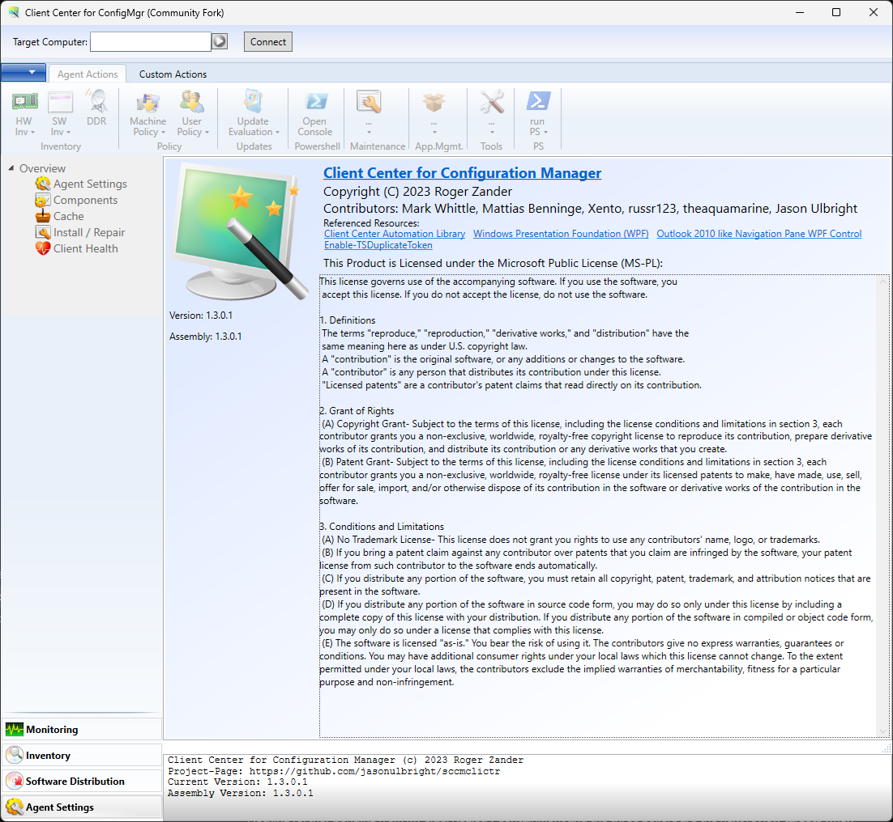

# Client Center for Configuration Manager

[](https://github.com/jasonulbright/sccmclictr/actions/workflows/ci.yml)
[](https://github.com/jasonulbright/sccmclictr/releases/latest)
[](https://github.com/jasonulbright/sccmclictr/releases)
[](#requirements)
[](#requirements)
[](LICENSE.md)
[](#project-scope)

A WPF desktop tool for IT professionals to troubleshoot Microsoft Configuration Manager (ConfigMgr/MECM) clients on remote Windows computers. Connect through WinRM to inspect client settings, services, deployments, updates, policy, logs, and inventory, and to run administrative actions from one place.



This is the maintained community continuation of [Roger Zander's original Client Center](https://github.com/rzander/sccmclictr). It preserves the proven .NET Framework application and plugin model while keeping the tool buildable, secure, and usable on current Windows and ConfigMgr releases.

## Install

Download the [latest release](https://github.com/jasonulbright/sccmclictr/releases/latest) and choose one of these assets:

- `ClientCenterForConfigMgr-Setup.exe` — recommended. Installs the application, registers it in Apps & Features, and creates Start menu and optional desktop shortcuts.
- `ClientCenterForConfigMgr-Portable.zip` — extract anywhere and run `SCCMCliCtrWPF.exe`; no installation or registry changes.
- `checksums.txt` — SHA-256 hashes for both release assets.

Release binaries and the installer are Authenticode-signed. The release workflow refuses to publish when the signing certificate is unavailable, and GitHub build-provenance attestations are attached to the assets. To verify the checksum in PowerShell:

```powershell
Get-FileHash .\ClientCenterForConfigMgr-Setup.exe -Algorithm SHA256
```

Compare the result with the matching line in `checksums.txt`.

### Requirements

Host machine (running Client Center):

| Component | Version |
|---|---|
| OS | Windows 10 1607+ / Windows Server 2016+ |
| .NET Framework | 4.8 |
| PowerShell | Windows PowerShell 5.1 |

Target machine (being managed):

| Component | Requirement |
|---|---|
| WinRM | Enabled (`winrm quickconfig`) |
| PowerShell | 4.0+ (5.1 recommended) |
| ConfigMgr client | Any supported version |
| Permissions | Local administrator rights on the target |

## Usage

Launch Client Center and enter the target hostname.

- Integrated authentication (recommended): run Client Center under an administrative account and connect without entering credentials. The current Kerberos token is used.
- Explicit credentials: enter `DOMAIN\username` and the password. Passwords are not persisted between sessions.

Command line:

```text
SCCMCliCtrWPF.exe <Hostname> [/Username:DOMAIN\user]
```

## Included plugins

| Plugin | Purpose |
|---|---|
| Computer Management | Open remote Computer Management |
| Explorer | Browse remote shares and log folders |
| PowerShell Scripts | Run the included or custom scripts on the connected client |
| RDP | Launch Remote Desktop |
| Registry Editor | Browse and edit the remote registry |
| Enable PSRemoting | Enable WinRM through WMI where needed |
| Status Message Viewer | View ConfigMgr status messages |
| Resource Explorer | Browse ConfigMgr resource inventory |
| Remote Tools | Launch ConfigMgr Remote Control |
| MSInfo32 | Open remote system information |
| MSRA | Launch Microsoft Remote Assistance |
| FEP | Inspect Endpoint Protection state |
| App-V 4.6 | Manage legacy App-V 4.6 applications |
| AMT Tools | Intel vPro/AMT remote actions |

## Community fork changes

- Integrated the formerly closed `sccmclictr.automation` NuGet library as maintainable .NET Framework 4.8 C# source.
- Removed the dead self-update and RuckZuck plugins that could block startup against retired services.
- Restored TLS certificate validation and removed the global trust-all callback.
- Removed plaintext password persistence and the `/Password:` command-line argument.
- Replaced `Invoke-Expression` installer calls with direct process invocation.
- Migrated the core automation helpers and primary client queries from deprecated WMI PowerShell syntax to CIM.
- Added a repeatable Release build for the application and all 14 plugins.
- Added signed installer and portable release assets, SHA-256 checksums, CI, and provenance attestations.

Some optional legacy PowerShell scripts intentionally retain WMI syntax because this maintenance fork continues to target Windows PowerShell 5.1 and old ConfigMgr environments. The exact migration status and remaining compatibility work are documented in [CODE_REVIEW.md](CODE_REVIEW.md).

## Security

| Area | Status |
|---|---|
| TLS certificate validation | Fixed |
| Plaintext password persistence | Removed |
| `Invoke-Expression` command injection | Removed |
| Password on the command line | Removed |
| WMI-to-CIM migration | Substantial; compatibility paths and optional scripts remain |
| Bare catch blocks | Audited and protected by a regression baseline |
| Vendored UI dependencies | Accepted for the .NET Framework maintenance lifecycle |
| Release integrity | Authenticode, SHA-256 checksums, and GitHub attestations |

Client Center is an administrative tool intended for trusted operators on managed internal networks. See [CODE_REVIEW.md](CODE_REVIEW.md) for the security and architecture review.

## Build from source

Prerequisites:

- Visual Studio 2022 or newer Build Tools with the .NET desktop build workload
- .NET Framework 4.8 targeting pack
- Windows PowerShell 5.1

Build the application, all plugins, and a portable staging directory:

```powershell
powershell -NoProfile -ExecutionPolicy Bypass -File .\scripts\build.ps1 -Configuration Release
```

Output: `artifacts\stage\SCCMCliCtrWPF.exe`

Run the MSTest suite after building:

```powershell
.\scripts\test.ps1 -Configuration Release
```

Run the CIM migration and optional live-environment Pester checks with Pester 5.7.1 or newer:

```powershell
.\scripts\test-pester.ps1
```

No NuGet restore is required; the stable third-party controls and MSTest assemblies are vendored under `lib\`. To compile the installer locally, install Inno Setup 6 or 7 and run:

```powershell
.\scripts\new-release-assets.ps1 -StageDirectory .\artifacts\stage -Version 1.4.0
```

Release signing and publication are documented in [docs/RELEASING.md](docs/RELEASING.md).

## Project scope

This is a maintenance-focused fork. Changes should improve compatibility, reliability, security, build repeatability, or distribution without rewriting the established .NET Framework 4.8 application. The experimental modern-WPF spike is not part of the shipping build.

## License and credits

Licensed under the [Microsoft Public License (MS-PL)](LICENSE.md), inherited from the original project.

- Original project and copyright: [Roger Zander](https://github.com/rzander/sccmclictr)
- Community maintenance and modernization: project contributors
